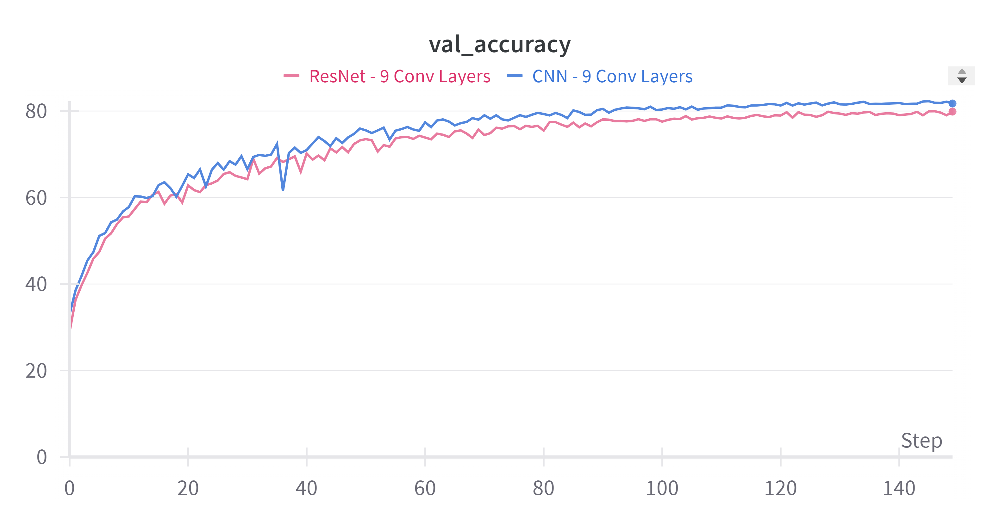
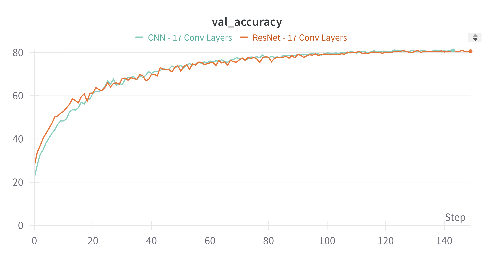
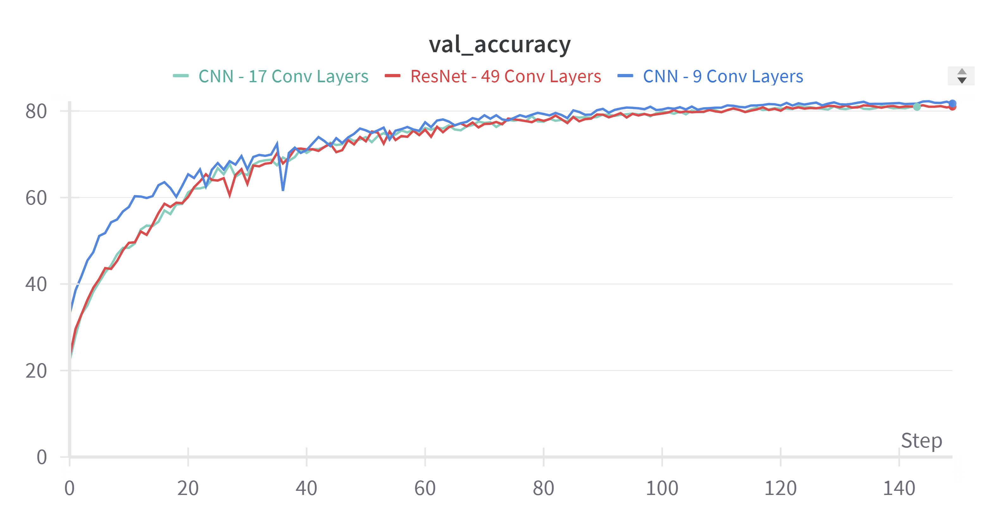
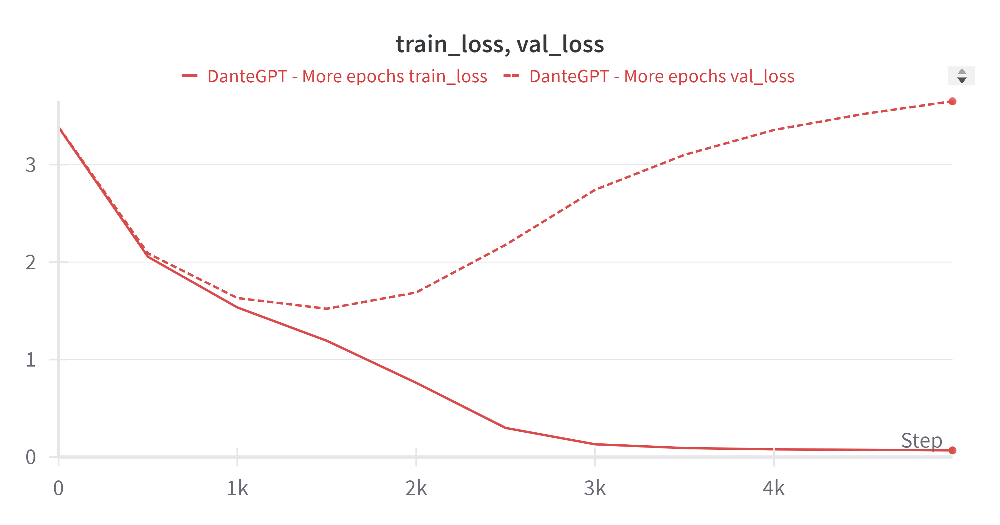
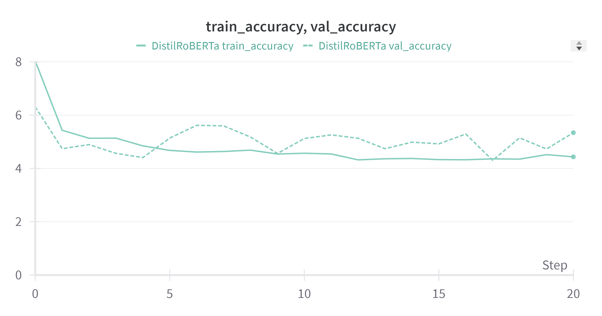
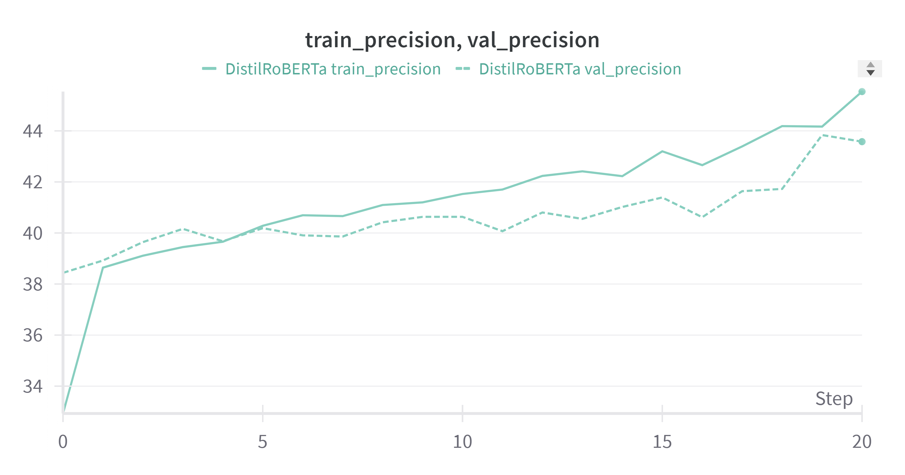
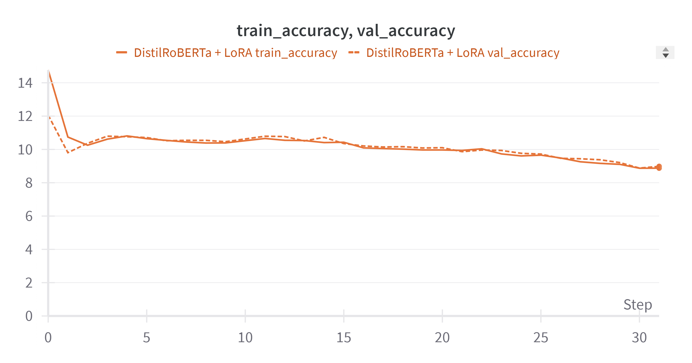
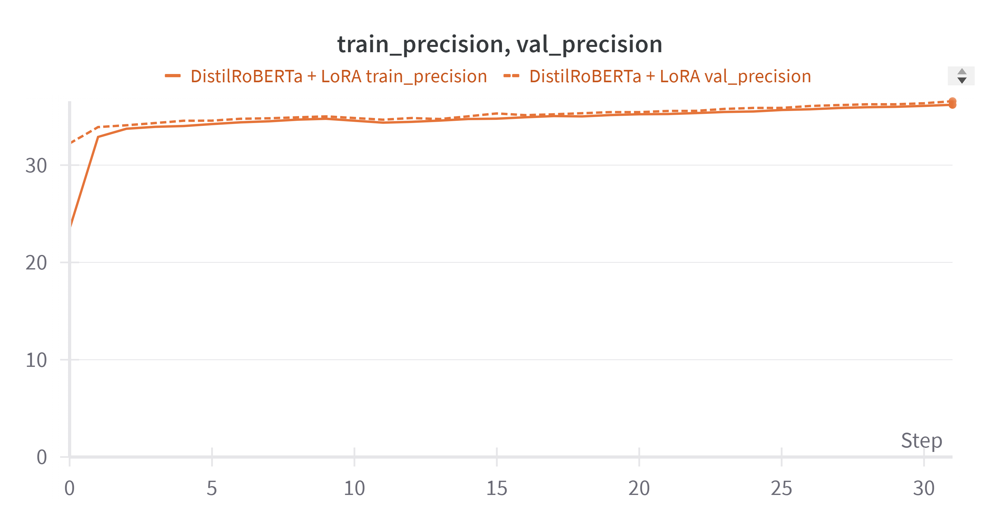

# Deep Learning Applications

This repository contains the implementation of three laboratories from the course "Deep Learning Application". This course is from the Artificial Intelligence degree course from University of Florence.

The labs focus on deep learning models on various areas of research. For every lab, its related folder contains the source code (`main.py`), a configuration file (`config.yaml`) file which contains the model, the dataset and the run specifics, and a result folder.

Apart from these folders, the `src` folder contains functions used throught the labs.

To log the runs of the exercises, [Weights and Biases](https://wandb.ai/site) has been used.

All the runs used early stopping during the training phase.

## Table Of Contents

- [Laboratory 1: Convolutional Neural Networks](#laboratory-1-convolutional-neural-networks)
    - [Exercise 1: Warming Up](#exercise-1-warming-up)
        - [Exercise 1.1: A baseline MLP](#exercise-11-a-baseline-mlp)
        - [Exercise 1.2: Rinse and Repeat](#exercise-12-rinse-and-repeat)
    - [Exercise 2: Choose at Least One](#exercise-2-choose-at-least-one)
        - [Exercise 2.3: Explaining the predictions of a CNN](#exercise-23-explaining-the-predictions-of-a-cnn)
- [Laboratory 2: Natural Language Processing & LLMs](#laboratory-2-natural-language-processing--llms)
    - [Exercise 1: Warming Up](#exercise-1-warming-up-1)
    - [Exercise 2: Working with Real LLMs](#exercise-2-working-with-real-llms)
    - [Exercise 3: Reusing Pre-trained LLMs](#exercise-3-reusing-pre-trained-llms)
        - [Exercise 3.1: Training a Text Classifier](#exercise-31-training-a-text-classifier)
- [Laboratory 4: Adversarial Learning and OOD Detection](#laboratory-4-adversarial-learning-and-ood-detection)
    - [Exercise 1: OOD Detection and Performance Evaluation](#exercise-1-ood-detection-and-performance-evaluation)
    - [Exercise 2: Enhancing Robustness to Adversarial Attack](#exercise-2-enhancing-robustness-to-adversarial-attack)
        - [Exercise 2.1: Implement FGSM and Generate Adversarial Examples](#exercise-21-implement-fgsm-and-generate-adversarial-examples)
        - [Exercise 2.2: Augment Training with Adversarial Examples](#exercise-22-augment-training-with-adversarial-examples)
    - [Exercise 3: Wildcard](#exercise-3-wildcard)
        - [Exercise 3.1: Implement ODIN for OOD Detection](#exercise-31-implement-odin-for-ood-detection)
        - [Exercise 3.3: Experiment with Targeted Adversarial Attacks](#exercise-33-experiment-with-targeted-adversarial-attacks)

## Laboratory 1: Convolutional Neural Networks
This laboratory focuses on working with simple architectures to gain experience with deep learning models, specifically using PyTorch.

The task is to reproduce, on a small scale, the results from the ResNet paper: 
> [Deep Residual Learning for Image Recognition](https://arxiv.org/abs/1512.03385), Kaiming He, Xiangyu Zhang, Shaoqing Ren, Jian Sun, CVPR 2016. 

demonstrating that deeper networks do not always lead to better training loss or validation accuracy, using first a Multilayer Perceptron (MLP) on the MNIST dataset, then a Convolutional Neural Network (CNN).

### Exercise 1: Warming Up
#### Exercise 1.1: A baseline MLP
Objective: Implement a *simple* Multilayer Perceptron to classify the 10 digits of MNIST (e.g. two *narrow* layers).

Results on test set:
|    Dataset    |  Loss  | Accuracy | Precision | Recall |
|   :-------:   | :----: | :------: | :-------: | :----: |
|     MNIST     | 0.055  | 98.547%  |  98.552%  | 98.547%|

Link to W&B report for MLP: https://api.wandb.ai/links/alessio-boetti/u5g4pltw

#### Exercise 1.2: Rinse and Repeat
Objective: Repeat the verification you did above, but with **Convolutional** Neural Networks, preferrably on a more complex dataset.

To start, I chose to implement a CNN with 9 convolutional layers on CIFAR10.
The model achieved a test set accuracy of 82.11%.

To push things further and see if it's true that depth doesn't increase performance for CNNs, I increased the number of conv layers. The following table shows the model trained along with their test performances:
|    Model          |  Loss  | Accuracy | Precision | Recall |
|   :-----:         | :----: | :------: | :-------: | :----: |
| **9 ConvLayers CNN**  | **0.657**  | **82.110%**  |  **82.008%**  | **82.110%**|
| 17 ConvLayers CNN | 0.734  | 80.560%  |  80.513%  | 80.560%|
| 33 ConvLayers CNN | 1.135  | 69.960%  |  69.882%  | 69.960%|
| 49 ConvLayers CNN | 1.617  | 52.030%  |  51.765%  | 52.030%|

Link to W&B report for CNNs with various depth: https://api.wandb.ai/links/alessio-boetti/2uurr5fu

Indeed the performance got drastically worse, going down of 36%, or 30 percentage points.
The worsening of the models is even clearer from the report above.

Then I tried adding Residual Connections, aka Skip Connections, to try to stabilize training and get better performance. Here are the results:
|    Model             |  Loss  | Accuracy | Precision | Recall |
|   :-----:            | :----: | :------: | :-------: | :----: |
| 9 ConvLayers ResNet  | 0.747  | 79.230%  |  79.093%  | 79.230%|
| 17 ConvLayers ResNet | 0.708  | 80.250%  |  80.244%  | 80.250%|
| 33 ConvLayers ResNet | 0.714  | 80.660%  |  80.522%  | 80.660%|
| **49 ConvLayers ResNet** | **0.700**  | **81.120%**  |  **80.978%**  | **81.120%**|

Link to W&B report for ResNets with various depth: https://api.wandb.ai/links/alessio-boetti/s802vpyf

As we can see both from the table and the report, the residual connections helped stabilize the training: they didn't support the assumption that deeper is better, but helped achieve nearly the same performance even when depth was increased.

It's interesting to note from the table though that adding skip connections to the 9 ConvLayer CNN, resulting in 9 ConvLayer ResNet, decreased a little the performance. This could be due to chance, and to check this more trainings could be run varying the seed.

However this pattern is also found throughout the training phase, when assessing the model on the validation set, as shown in the following two images:

  

  

This could be due to the following:
- Residual connections add unnecessary complexity for a shallow CNN where the vanishing gradient problem is not so relevant.
- For shallow nets the identity mapping could interfere the learning process bypassing the non-linear transformations of the conv layers. 
- Residual connections introduce a bias towards learning an identity function. Added to shallow CNNs, this can be counterproductive if the task requires more complex feature transformations

It should also be noted that the deepest ResNet (49 conv layers) is still worse than shallow CNNs (9 and 17 conv layers):

  

### Exercise 2: Choose at Least One
#### Exercise 2.3: Explaining the predictions of a CNN
Objective: Use the CNN model you trained in Exercise 1.2 and implement [*Class Activation Maps*](http://cnnlocalization.csail.mit.edu/#:~:text=A%20class%20activation%20map%20for,decision%20made%20by%20the%20CNN.) (below). Use your implementation to demonstrate how your trained CNN *attends* to specific image features to recognize *specific* classes.

> B. Zhou, A. Khosla, A. Lapedriza, A. Oliva, and A. Torralba. Learning Deep Features for Discriminative Localization. CVPR'16 (arXiv:1512.04150, 2015).

I decided to use Grad-CAM instead of CAM to explain the CNN predictions on CIFAR10.

In Grad-CAM, an image is given to the model along with its class label. The gradient of the logits of the class w.r.t the activations maps of the final convolutional layer is computed and then the gradients are averaged across each feature map to give an importance score:

$\alpha_{k}^{c} = \frac{1}{Z}\sum_{i}\sum_{j}\frac{{\partial}y^{c}}{{\partial}A_{ij}^{k}}$

where the two summations are the Global Average Pooling mechanism, the derivative represents the gradient backpropagation, $k$ is the index of the activation map in the last convolutional layer, and $c$ is the class of interest.

In the results folder of the lab exercise the grad-cam heatmaps can be found.
Unfortunately the heatmaps didn't come out enough complex.

## Laboratory 2: Natural Language Processing & LLMs
In this laboratory we will get our hands dirty working with Large Language Models (e.g. GPT and BERT) to do various useful things.

### Exercise 1: Warming Up
Objective: In this first exercise you will train a *small* autoregressive GPT model for character generation to generate text in the style of Dante Aligheri.

Results on validation set:
|    Dataset      |  Loss  |
|   :-------:     | :----: |
| Dante's Inferno | 3.651  |

  

From the above image we can clearly see the model overfits quite soon (on 5000 epochs).

Here the generated output in Dante's style (1000 tokens):

>   come Suo rote la` dove testa
>   la ritte e la dove parte queta,
> 
> la\` di qua, dopo al pologno del sasso;
>   porsentando e\` questa gente stanca
>   non puote fu rico de la belle stelle,
> 
> 'altro fu l'usuria castra Giace.
>   meco d'un su Nome ch'intrato acquesio.
> 
> Cola\` e\` colui che si\` presso s'appressa,
>   che dal cominciar, con l'occhio fora
>   del garonso, ciglio\` ne li altri piedi sparte.
> 
> Ma dimmi, de l'alto socchio si scovra,
>   guardoliar piu\` convien ch'io ti 'ntesi,
>   raguardar piu\` a via diversa leggia
> 
> gente viscende ove non fasse,
>   faldo venir le mostra persona fronte.
> 
> <<I s'appura di colorno scio\` accascio>>,
>   comincio` olsi con l'occhio a volse;
>   <<e se la voce lucia tanto non dispiaccia.
> 
> Noi si discende mai a lor vieta in forte
>   de la sua scurgelme, o lo 'nfernio dolce
>   che parlar via memolte me ali,
> 
> mosse, per fuor de la bola la marca
>   dove 'l sangue in lor non si puo\`,
>   com'io mi al certo perco\` a Maoneta,
> 
> quando la brina in su la terra e lassa,
>   si leva, giacendo l

The output doesn't make sense in italian, but it's clearly recognizable as a text with an antique style. The way syllables are concatenated gives a quite impressive result. 

It's also worth noting the sequence of two-line paragraphs, and even the insertion of double quotes <<>>, meaning the model learned to capture the structural connection between a spoken phrase and other parts of the text.

### Exercise 2: Working with Real LLMs
Objective: In this exercise we will see how to use the [Hugging Face](https://huggingface.co/) model and dataset ecosystem to access a *huge* variety of pre-trained transformer models. Instantiate the `GPT2Tokenizer` and experiment with encoding text into integer tokens. Compare the length of input with the encoded sequence length. Then instantiate a pre-trained `GPT2LMHeadModel` and use the [`generate()`](https://huggingface.co/docs/transformers/v4.27.2/en/main_classes/text_generation#transformers.GenerationMixin.generate) method to generate text from a prompt.

### Exercise 3: Reusing Pre-trained LLMs
#### Exercise 3.1: Training a Text Classifier
Objective: Peruse the [text classification datasets on Hugging Face](https://huggingface.co/datasets?task_categories=task_categories:text-classification&sort=downloads). Choose a *moderately* sized dataset and use a LLM to train a classifier to solve the problem.

I chose [DistilRoBERTa](https://huggingface.co/distilbert/distilroberta-base) as LLM for the exercise. DistilRoBERTa is a small LLM but can learn powerful and complex representations rivaling with other BERT-like models.

I fine-tuned the model on the [Yelp Review Full](https://huggingface.co/datasets/Yelp/yelp_review_full) text classification dataset. The model

Every epoch of the training of DistilRoBERTa took several minutes, and looking for ways to speed up the training, I also fine-tuned the model using the [LoRA](https://arxiv.org/abs/2106.09685) method, which however did not speed up the training as much as expected.

Results on the test set:
|    Model          |  Loss  | Accuracy | Precision | Recall |
|   :-----:         | :----: | :------: | :-------: | :----: |
| DistilRoBERTa | **2.289** | 5.322% | **42.748%** | 5.322% |
| DistilRoBERTa + LoRA | 2.291  | **8.945%**  |  36.040%  | **8.945%**|

Surprisingly, when fine-tuning both models, the best epoch registered was the first (they both stopped due to early stopping after a few epochs). However the precision performance on the validation set had an increasing trend. Since the early stopping was measured on the accuracy on the validation set, this could mean that the accuracy may not be the best metric to assess the model performance (see images below). Also, the early stopping was set to a low value (20 epochs) due to the long time taken by a single training epoch.

  

  

  

  

## Laboratory 4: Adversarial Learning and OOD Detection
In this laboratory session we will develop a methodology for detecting OOD samples and measuring the quality of OOD detection. We will also experiment with incorporating adversarial examples during training to render models more robust to adversarial attacks.

### Exercise 1: OOD Detection and Performance Evaluation
Objective: In this first exercise you will build a simple OOD detection pipeline and implement some performance metrics to evaluate its performance. There are several metrics used to evaluate OOD detection performance, we will concentrate on two threshold-free approaches: the area under the Receiver Operator Characteristic (ROC) curve for ID classification, and the area under the Precision-Recall curve for *both* ID and OOD scoring.

I used a 9 Conv Layer CNN due to its fast training time and high accuracy. This model will be used throughout all the following exercises.

I chose CIFAR10 as ID dataset and SVHN as OOD dataset.

The model has been retrained with different settings, and the resulting test set performance is different from the first training (see [Exercise 1.2](#exercise-12-rinse-and-repeat)). This is mainly due to not training with augmented samples (<code>augment: False</code> in the <code>config.yaml</code> file), since the model performance needed to be a baseline for the following exercises and using augmentation with OOD could have produced misleading or less clear results.

Results on the test set:
| Dataset |  Loss  | Accuracy | Precision | Recall |
| :-----: | :----: | :------: | :-------: | :----: |
| CIFAR10 (ID) | 1.034  | 77.110%  |  76.924%  | 77.110%|
| SVHN (OOD) | 7.178  | 9.201%  |  8.745%  | 9.201%|

From the table it seems like the model clearly distinguished the OOD images as coming from a different distribution than the ID images.
Let's check the plots.

ID confusion matrix:

  

OOD confusion matrix:

  

As we can see from the confusion matrices, when predicting the class for OOD images, the model predicted with high frequency the classes 0, 3, 5, 8. We could say that the model predicted a 0 to be an airplane, a 3 to be a cat, a 5 to be a dog and an 8 to be a ship.

  

  

  

  

  

The precision-recall curve and the ROC curve showed good performances, indicating the model is able to separate well enough the two classes for many decision thresholds.

However the scores histograms don't appear very separable, but the line plot shows that many OOD scores have higher values than the ID scores.

### Exercise 2: Enhancing Robustness to Adversarial Attack
In this second exercise we will experiment with enhancing our base model to be (more) robust to adversarial attacks.
#### Exercise 2.1: Implement FGSM and Generate Adversarial Examples
Objective: Implement FGSM and generate some *adversarial examples* using your trained ID model. Evaluate these samples qualitatively and quantitatively. Evaluate how dependent on $\varepsilon$ the quality of these samples are. 

Using the model from the previous exercise, I performed [Randomized FGSM](https://arxiv.org/abs/2001.03994)
> Fast is better than free: Revisiting adversarial training, Eric Wong, Leslie Rice, J. Zico Kolter. 2020

to obtain corrupted images for various values of $\varepsilon$. In the lab exercise [result folder](./Lab4%20-%20Ex%202.1/results/Adv%20Images%20-%20CNN%20-%209%20Conv%20Layers/) the corrupted images ($\varepsilon = 0$ means no attack) and their difference from the original images can be found.

In the same folder there are the result plots created when treating adversarial images (for various values of $\varepsilon$) as OOD samples for the NON adversarially trained model.

Here are the results:

#### Exercise 2.2: Augment Training with Adversarial Examples
Objective: Use your implementation of FGSM to augment your training dataset with adversarial samples. Ideally, you should implement this data augmentation *on the fly* so that the adversarial samples are always generated using the current model. Evaluate whether the model is more (or less) robust to ID samples using your OOD detection pipeline and metrics you implemented in Exercise 1.
### Exercise 3: Wildcard
#### Exercise 3.1: Implement ODIN for OOD Detection
Notes: ODIN is a very simple approach, and you can already start experimenting by implementing a temperature hyperparameter in your base model and doing a grid search on $T$ and $\varepsilon$.
#### Exercise 3.3: Experiment with Targeted Adversarial Attacks
Objective: Implement the targeted Fast Gradient Sign Method to generate adversarial samples that *imitate* samples from a specific class. Evaluate your adversarial samples qualitatively and quantitatively.