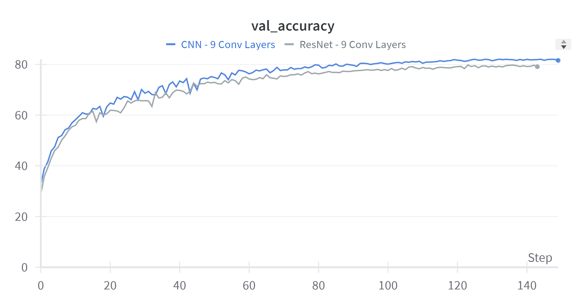

# Deep Learning Applications

This repository contains the implementation of three laboratories from the course "Deep Learning Application". This course is from the Artificial Intelligence degree course from University of Florence.

The labs focus on deep learning models on various areas of research. For every lab, its related folder contains the source code (`main.py`), a configuration file (`config.yaml`) file which contains the model, the dataset and the run specifics, and a result folder.

Apart from these folders, the `src` folder contains functions used throught the labs.

To log the runs of the exercises, [Weights and Biases](https://wandb.ai/site) has been used.

## Table Of Contents

- [Laboratory 1: Convolutional Neural Networks](#Laboratory-1-Convolutional-Neural-Networks)
    - [Exercise 1: Warming Up](#Exercise-1-Warming-Up)
        - [Exercise 1.1: A baseline MLP](#Exercise-1.1-A-baseline-MLP)
        - [Exercise 1.2: Rinse and Repeat](#Exercise-1.2-Rinse-and-Repeat)
    - [Exercise 2: Choose at Least One](#Exercise-2-Choose-at-Least-One)
        - [Exercise 2.3: Explaining the predictions of a CNN](#Exercise-2.3-Explaining-the-predictions-of-a-CNN)
- [Laboratory 2: Natural Language Processing & LLMs](#Laboratory-2-Natural-Language-Processing)
    - [Exercise 1: Warming Up](#Exercise-1-Warming-Up)
    - [Exercise 2: Working with Real LLMs](#Exercise-2-Working-with-Real-LLMs)
    - [Exercise 3: Reusing Pre-trained LLMs](#Exercise-3-Reusing-Pre-trained-LLMs)
        - [Exercise 3.1: Training a Text Classifier](#Exercise-3.1-Training-a-Text-Classifier)
- [Laboratory 4: Adversarial Learning and OOD Detection](#Laboratory-4-Adversarial-Learning-and-OOD-Detection)
    - [Exercise 1: OOD Detection and Performance Evaluation](#Exercise-1-OOD-Detection-and-Performance-Evaluation)
    - [Exercise 2: Enhancing Robustness to Adversarial Attack](#Exercise-2-Enhancing-Robustness-to-Adversarial-Attack)
        - [Exercise 2.1: Implement FGSM and Generate Adversarial Examples](#Exercise-2.1-Implement-FGSM-and-Generate-Adversarial-Examples)
        - [Exercise 2.2: Augment Training with Adversarial Examples](#Exercise-2.2-Augment-Training-with-Adversarial-Examples)
    - [Exercise 3: Wildcard](#Exercise-3-Wildcard)
        - [Exercise 3.1: Implement ODIN for OOD Detection](#Exercise-3.1-Implement-ODIN-for-OOD-Detection)
        - [Exercise 3.3: Experiment with Targeted Adversarial Attacks](#Exercise-3.3-Experiment-with-Targeted-Adversarial-Attacks)

## Laboratory 1: Convolutional Neural Networks
This laboratory focuses on working with simple architectures to gain experience with deep learning models, specifically using PyTorch.

The task is to reproduce, on a small scale, the results from the ResNet paper: 
> [Deep Residual Learning for Image Recognition](https://arxiv.org/abs/1512.03385), Kaiming He, Xiangyu Zhang, Shaoqing Ren, Jian Sun, CVPR 2016. 

demonstrating that deeper networks do not always lead to better training loss or validation accuracy, using first a Multilayer Perceptron (MLP) on the MNIST dataset, then a Convolutional Neural Network (CNN).

### Exercise 1: Warming Up
#### Exercise 1.1: A baseline MLP
Objective: Implement a *simple* Multilayer Perceptron to classify the 10 digits of MNIST (e.g. two *narrow* layers).

Results on test set:
|    Dataset    |  Loss  | Accuracy | Precision | Recall |
|   :-------:   | :----: | :------: | :-------: | :----: |
|     MNIST     | 0.055  | 98.547%  |  98.552%  | 98.547%|

Link to W&B report for MLP: https://api.wandb.ai/links/alessio-boetti/u5g4pltw

#### Exercise 1.2: Rinse and Repeat
Objective: Repeat the verification you did above, but with **Convolutional** Neural Networks, preferrably on a more complex dataset.

To start, I chose to implement a CNN with 9 convolutional layers on CIFAR10.
The model achieved a test set accuracy of 82.11%.

To push things further and see if it's true that depth doesn't increase performance for CNNs, I increased the number of conv layers. The following table shows the model trained along with their test performances:
|    Model          |  Loss  | Accuracy | Precision | Recall |
|   :-----:         | :----: | :------: | :-------: | :----: |
| **9 ConvLayers CNN**  | **0.657**  | **82.110%**  |  **82.008%**  | **82.110%**|
| 17 ConvLayers CNN | 0.734  | 80.560%  |  80.513%  | 80.560%|
| 33 ConvLayers CNN | 1.135  | 69.960%  |  69.882%  | 69.960%|
| 49 ConvLayers CNN | 1.617  | 52.030%  |  51.765%  | 52.030%|

Link to W&B report for CNNs with various depth: https://api.wandb.ai/links/alessio-boetti/2uurr5fu

Indeed the performance got drastically worse, going down of 36%, or 30 percentage points.
The worsening of the models is even clearer from the report above.

Then I tried adding Residual Connections, aka Skip Connections, to try to stabilize training and get better performance. Here are the results:
|    Model             |  Loss  | Accuracy | Precision | Recall |
|   :-----:            | :----: | :------: | :-------: | :----: |
| 9 ConvLayers ResNet  | 0.747  | 79.230%  |  79.093%  | 79.230%|
| 17 ConvLayers ResNet | 0.708  | 80.250%  |  80.244%  | 80.250%|
| 33 ConvLayers ResNet | 0.714  | 80.660%  |  80.522%  | 80.660%|
| **49 ConvLayers ResNet** | **0.700**  | **81.120%**  |  **80.978%**  | **81.120%**|

Link to W&B report for ResNets with various depth: https://api.wandb.ai/links/alessio-boetti/s802vpyf

As we can see both from the table and the report, the residual connections helped stabilize the training: they didn't support the assumption that deeper is better, but helped achieve nearly the same performance even when depth was increased.

It's interesting to note from the table though that adding skip connections to the 9 ConvLayer CNN, resulting in 9 ConvLayer ResNet, decreased a little the performance. This could be due to chance, and to check this more trainings could be run varying the seed.

However this pattern is also found throughout the training phase, when assessing the model on the validation set, as shown in the following two images:

  

  

This could be due to the following:
- Residual connections add unnecessary complexity for a shallow CNN where the vanishing gradient problem is not so relevant.
- For shallow nets the identity mapping could interfere the learning process bypassing the non-linear transformations of the conv layers. 
- Residual connections introduce a bias towards learning an identity function. Added to shallow CNNs, this can be counterproductive if the task requires more complex feature transformations

It should also be noted that the deepest ResNet (49 conv layers) is still worse than shallow CNNs (9 and 17 conv layers):

  

### Exercise 2: Choose at Least One
#### Exercise 2.3: Explaining the predictions of a CNN
Objective: Use the CNN model you trained in Exercise 1.2 and implement [*Class Activation Maps*](http://cnnlocalization.csail.mit.edu/#:~:text=A%20class%20activation%20map%20for,decision%20made%20by%20the%20CNN.):

> B. Zhou, A. Khosla, A. Lapedriza, A. Oliva, and A. Torralba. Learning Deep Features for Discriminative Localization. CVPR'16 (arXiv:1512.04150, 2015).

Use your implementation to demonstrate how your trained CNN *attends* to specific image features to recognize *specific* classes.

## Laboratory 2: Natural Language Processing & LLMs
In this laboratory we will get our hands dirty working with Large Language Models (e.g. GPT and BERT) to do various useful things.

### Exercise 1: Warming Up
Objective: In this first exercise you will train a *small* autoregressive GPT model for character generation to generate text in the style of Dante Aligheri.

### Exercise 2: Working with Real LLMs
Objective: In this exercise we will see how to use the [Hugging Face](https://huggingface.co/) model and dataset ecosystem to access a *huge* variety of pre-trained transformer models. Instantiate the `GPT2Tokenizer` and experiment with encoding text into integer tokens. Compare the length of input with the encoded sequence length. Then instantiate a pre-trained `GPT2LMHeadModel` and use the [`generate()`](https://huggingface.co/docs/transformers/v4.27.2/en/main_classes/text_generation#transformers.GenerationMixin.generate) method to generate text from a prompt.

### Exercise 3: Reusing Pre-trained LLMs
#### Exercise 3.1: Training a Text Classifier
Objective: Peruse the [text classification datasets on Hugging Face](https://huggingface.co/datasets?task_categories=task_categories:text-classification&sort=downloads). Choose a *moderately* sized dataset and use a LLM to train a classifier to solve the problem.

## Laboratory 4: Adversarial Learning and OOD Detection
In this laboratory session we will develop a methodology for detecting OOD samples and measuring the quality of OOD detection. We will also experiment with incorporating adversarial examples during training to render models more robust to adversarial attacks.

### Exercise 1: OOD Detection and Performance Evaluation
Objective: In this first exercise you will build a simple OOD detection pipeline and implement some performance metrics to evaluate its performance. There are several metrics used to evaluate OOD detection performance, we will concentrate on two threshold-free approaches: the area under the Receiver Operator Characteristic (ROC) curve for ID classification, and the area under the Precision-Recall curve for *both* ID and OOD scoring.
### Exercise 2: Enhancing Robustness to Adversarial Attack
In this second exercise we will experiment with enhancing our base model to be (more) robust to adversarial attacks.
#### Exercise 2.1: Implement FGSM and Generate Adversarial Examples
Objective: Implement FGSM and generate some *adversarial examples* using your trained ID model. Evaluate these samples qualitatively and quantitatively. Evaluate how dependent on $\varepsilon$ the quality of these samples are. 
#### Exercise 2.2: Augment Training with Adversarial Examples
Objective: Use your implementation of FGSM to augment your training dataset with adversarial samples. Ideally, you should implement this data augmentation *on the fly* so that the adversarial samples are always generated using the current model. Evaluate whether the model is more (or less) robust to ID samples using your OOD detection pipeline and metrics you implemented in Exercise 1.
### Exercise 3: Wildcard
#### Exercise 3.1: Implement ODIN for OOD Detection
Notes: ODIN is a very simple approach, and you can already start experimenting by implementing a temperature hyperparameter in your base model and doing a grid search on $T$ and $\varepsilon$.
#### Exercise 3.3: Experiment with Targeted Adversarial Attacks
Objective: Implement the targeted Fast Gradient Sign Method to generate adversarial samples that *imitate* samples from a specific class. Evaluate your adversarial samples qualitatively and quantitatively.

### Result:

|     Net     |  Accuracy  |  Loss  |
| :---------: | :--------: |  :--:  |
| MLP         |    32.57   |  28.10 |